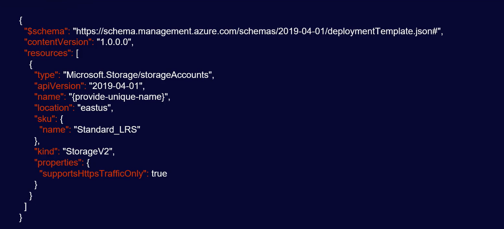

# Introduction to AZ-900

## Azure CLI
CLI is a command line too l to manage resources is Azure. It can perform the same functions as the Azure Portal.
- Stable: Text commands dont change
- Strucure: CLI commands are structured very logically and all follow the same patern
- Cross Platform: The CLI works on Windows, Mac and Linux
- Automation: It is simple to automate the CLI commands
- Logging: Keep track of commands that were run.


## PowerShell
PowerShell is a command line interface that uses commandlets to perform various tasks. PowerShell can be used to run commands for various environments and can be used to interface with the Azure Resource Manager. An example of the command to create a new VM in Azure : ``` New-AzVM ```

## Cloud Shell
Azure Cloud Shell is an interactive, browser accessible shell for managing Azure resources. 
- The Azure Cloud Shell can be accessed from anywhere using the Web or Mobile app and Authentication is secure.
- The Azure Cloud Shell can use either Bash (Azure CLI) or PowerShell.
- Tools included with the Azur Cloud Shell are Interpreters, modules, Azure Tools and language support for Node.js, .Net and Python
- The Azure Clou Shell has dedicated storage to persist data between session. 
- The Azure Clous Shell includes a complete file editor

## ARM Templates
[The Azure Resource Manager (ARM)](https://docs.microsoft.com/en-us/azure/azure-resource-manager/management/overview) is the gateway to managing everything in Azure.
[ARM Templates](https://docs.microsoft.com/en-us/azure/azure-resource-manager/templates/overview) are a way to define which resources you want to create, update delete etc. in Azure. ARM Templates will have the same result each time they are run and can be used to automate processes in Azure.

### ARM Template Example for creating a Storage Account



[back](ReadMe.md)

